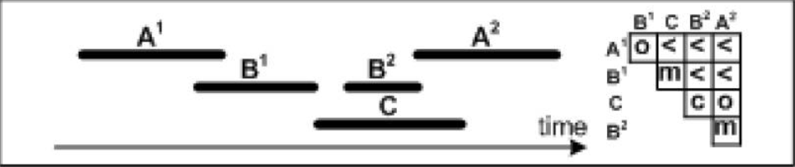
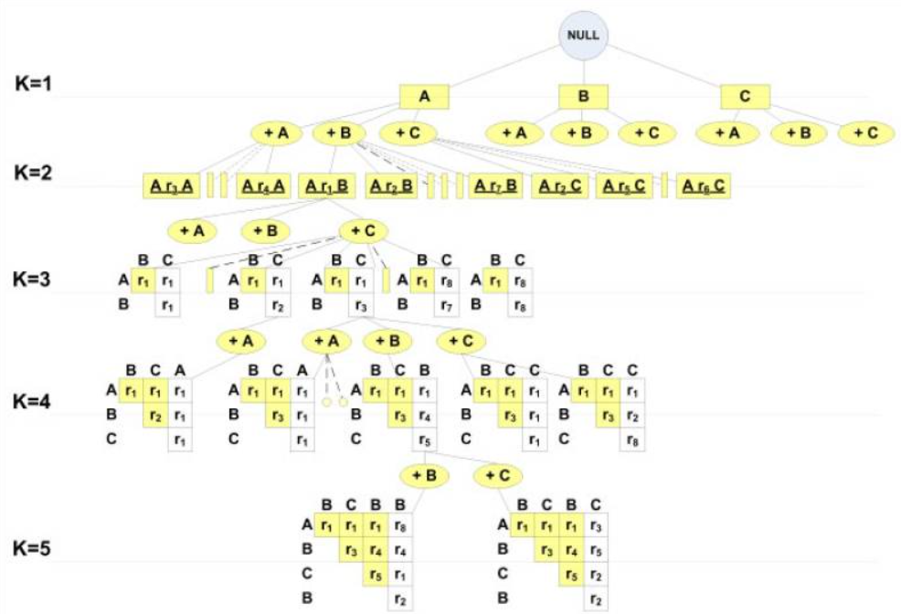

# KarmaLego

**Implementation of the KarmaLego time-interval pattern mining pipeline with end-to-end data ingestion, pattern discovery, and patient-level application.**

Based on the paper:  
*Moskovitch, Robert, and Yuval Shahar. "Temporal Patterns Discovery from Multivariate Time Series via Temporal Abstraction and Time-Interval Mining."*  
(See [original](https://pmc.ncbi.nlm.nih.gov/articles/PMC2815492/) for theoretical grounding.)

This implementation is inspired by **markozeman** implementation, available on this [link](https://github.com/markozeman/KarmaLego), and is designed to be used as an temporal analysis tool in my thesis.

## How KarmaLego Works

KarmaLego mines **frequent time-interval relation patterns (TIRPs)** by combining two key stages:

### 1. Temporal Relation Encoding

KarmaLego first scans each patient's timeline to identify pairwise **Allen relations** (e.g., before, overlaps, meets) between intervals:

<p align="center">
  
</p>

Each cell in the matrix shows the temporal relation between intervals (e.g., `A¹ o B¹` = A¹ overlaps B¹). These relations become the building blocks of complex temporal patterns.

---

### 2. Tree-Based Pattern Extension (Lego Phase)

Patterns are built incrementally by traversing a **tree of symbol and relation extensions**, starting from frequent 1-intervals (K=1) and growing to longer TIRPs (K=2,3,...). Only frequent patterns are expanded (Apriori pruning), and relation consistency is ensured using transitivity rules.

Practical flow in this implementation. The pipeline enumerates singletons and all frequent pairs (k=2) in the Karma stage. The Lego stage then skips extending singletons and starts from k≥2, extending patterns to length k+1. This avoids regenerating pairs (and their support checks) a second time. I also apply CSAC (see below), which anchors each extension on the actual parent embeddings inside each entity, ensuring only consistent child embeddings are considered.

<p align="center">
  
</p>

This structure enables efficient discovery of high-order, temporally consistent patterns without exhaustively searching all combinations.


---

## Repository Overview

This repository provides:
- A **clean, efficient implementation** of KarmaLego (Karma + Lego) for discovering frequent Time Interval Relation Patterns (TIRPs).
- Support for **pandas / Dask-backed ingestion** of clinical-style interval data.
- Symbol encoding, pattern mining, and per-patient pattern application (apply modes: counts and cohort-normalized features).
- Utilities for managing temporal relations, pattern equality/deduplication, and tree-based extension.

The design goals are: **clarity, performance, testability, and reproducibility**.

---

## KarmaLego Performance Optimizations (SAC + CSAC)
This implementation incorporates several core performance techniques from the KarmaLego framework:

1. **Apriori pruning:**
Patterns are extended only if all their (k−1)-subpatterns are frequent, cutting unpromising branches early.

2. **Temporal relation transitivity (+ memoization):**
Allen relation composition reduces relation search at extension time; the `compose_relation()` function is memoized to eliminate repeated small-table lookups.

3. **SAC (Subset of Active Candidates):**
Support checks for a child TIRP are restricted to the entities that supported its parent, avoiding scans of unrelated entities at deeper levels.

4. **CSAC (Consistent SAC, embedding-level):**
Beyond entity filtering, we maintain the exact parent embeddings (index tuples) per entity and only accept child embeddings that extend those specific tuples.

  - Accuracy: identical to full search; CSAC is pruning, not approximation.
  - Speed: large savings in dense timelines; no wasted checks on impossible extensions.

5. **Skip duplicate pair generation:**
Pairs (k=2) are produced once in Karma and not re-generated in Lego. This eliminates ~×2 duplication for pairs and can reduce Lego runtime dramatically.

6. **Precomputed per-entity views (reused everywhere):**
Lexicographic sorting and symbol→positions maps are built once and reused in support checks and extension, avoiding repeat work.

7. **Integer time arithmetic:**
Timestamps are held as `int64`; relation checks use pure integer math. If source data were datetimes, they are converted to ns; if they were numeric, they remain your unit.

These optimizations ensure that KarmaLego runs efficiently on large temporal datasets and scales well as pattern complexity increases.

**Performance Notes:**
- The core KarmaLego algorithm operates on in-memory Python lists (`entity_list`) and is not accelerated by Dask.
- The current Lego phase runs sequentially. Attempts to parallelize it (e.g., with Dask or multiprocessing) introduced overhead that slowed performance.
- Dask can still be useful during ingestion and preprocessing (e.g., using `dd.read_csv()` for large CSVs).
- Fine-grained parallelism is not recommended due to fast per-node checks and high task management overhead. If the support task increases significantly, perhaps a patient-level parallelism of a TIRP will become useful.
- Better scaling can be achieved by:
  - Splitting the dataset into concept clusters or patient cohorts and running in parallel across jobs.
  - Using `min_ver_supp` and `max_k` to control pattern explosion.
  - Persisting symbol maps to ensure consistent encoding across runs.
- No k=1→k=2 in Lego: pairs are already created in Karma; Lego starts from k≥2. This removes structural duplicates and their support checks.
- CSAC memory hygiene: parent embedding state is released after each support check; leaf nodes release their own embedding maps, keeping peak RAM lower on large runs.

---

## Repository Structure

```
KarmaLego/
├── core/
│   ├── __init__.py                             # package marker
│   ├── karmalego.py                            # algorithmic core: TreeNode, TIRP, KarmaLego/Karma/Lego pipeline
│   ├── io.py                                   # ingestion / preprocessing / mapping / decoding helpers
│   ├── relation_table.py                       # temporal relation transition tables and definitions
│   └── utils.py                                # low-level helpers
├── data/
│   ├── synthetic_diabetes_temporal_data.csv    # example input dataset
│   ├── symbol_map.json                         # saved symbol encoding (concept:value -> int)
│   └── inverse_symbol_map.json                 # reverse mapping for human-readable decoding
├── unittests/
│   ├── test_treenode.py                        # TreeNode behavior
│   ├── test_tirp.py                            # TIRP equality, support, relation semantics
│   └── test_karmalego.py                       # core pipeline / small synthetic pattern discovery
├── main.py                                     # example end-to-end driver / demo script
├── pyproject.toml                              # editable installation manifest
├── pytest.ini                                  # pytest configuration
├── requirements.txt                            # pinned dependencies (pandas, dask, tqdm, pytest, numpy, etc.)
├── README.md                                   # human-readable version of this document
└── .gitignore                                  # ignored files for git
```

---

## Installation

Recommended Python version: **3.8+**

Use a virtual environment:

```bash
python -m venv .venv
# Windows:
.\.venv\Scripts\activate

pip install -e .
pip install -r requirements.txt pytest
```

The `-e .` makes the local package importable as `core.karmalego` during development.

---

## Data Format Expected

Input must be a table (CSV or DataFrame) with these columns:

- `PatientID` : identifier per entity (patient)
- `ConceptName` : event or concept (e.g., lab test name)
- `StartDateTime` : interval start (e.g., `"08/01/2023 00:00"` in `DD/MM/YYYY HH:MM`)
- `EndDateTime` : interval end (same format)
- `Value` : discrete value or category (e.g., `'High'`, `'Normal'`)

You have full flexibility to affect the input and output shapes and formats in the `io.py` module, as long as you maintain this general structure.

Example row:
```
PatientID,ConceptName,StartDateTime,EndDateTime,Value
p1,HbA1c,08/01/2023 0:00,08/01/2023 0:15,High
```

---

## End-to-End Demo (main.py)

The provided `main.py` demonstrates the full pipeline:

1. **Load the CSV** (switch to Dask if scaling).
2. **Validate schema** and required fields.
3. **Build or load symbol mappings** (`ConceptName:Value` → integer codes).
4. **Preprocess**: parse dates, apply mapping.
5. **Convert to entity_list** (list of per-patient interval sequences).
6. **Discover patterns** using KarmaLego.
7. **Decode patterns** back to human-readable symbol strings.
8. **Apply patterns** to each patient using the apply modes (see below): `tirp-count`, `tpf-dist`, `tpf-duration`.
9. **Persist outputs:** discovered_patterns.csv and a single wide CSV with five feature columns per pattern.

Example invocation:

```bash
python main.py
```

This produces:
- `discovered_patterns.csv` — flat table of frequent TIRPs with support and decoded symbols.
- `patient_pattern_vectors.ALL.csv` — one row per (PatientID, Pattern) with 5 columns:
    tirp_count_unique_last, tirp_count_all, tpf_dist_unique_last, tpf_dist_all, tpf_duration

You can pivot `patient_pattern_vectors.ALL.csv` to a wide feature matrix for modeling.

---

## Key Concepts / Parameters

- `epsilon` : temporal tolerance for equality/meet decisions (same unit as your preprocessed timestamps). If source columns were datetimes, they are converted to ns, so you may pass a numeric ns value or a `pd.Timedelta`.
- `max_distance` : maximum gap between intervals to still consider them related (e.g., 1 hour → `pd.Timedelta(hours=1)`), same unit rule as above.
- `min_ver_supp` : minimum vertical support threshold (fraction of patients that must exhibit a pattern for it to be retained).

### Apply Modes

- `tirp-count`  
  Horizontal support per patient. Counting strategy:
  - **unique_last (default):** count **one** occurrence per **distinct last-symbol index** among valid embeddings (e.g., in `A…B…A…B…C`, `A<B<C` counts **1**).
  - **all:** count **every embedding**.

- `tpf-dist`  
  Min–max normalize the `tirp-count` values across the cohort **per pattern** into **[0,1]**.

- `tpf-duration`  
  For each patient and pattern, take the **union of the pattern’s embedding windows**-each window is the full span from the **start of the first** interval in the embedding to the **end of the last**-so overlapping/touching windows are **merged** and **not** double-counted (gaps inside a window are included). The per-patient total is then **min–max normalized across patients (per pattern)** to **[0,1]**.  
  *Example:* if `A<B` occurs with windows of 10h and 5h that **don’t overlap**, duration = `10 + 5 = 15`; if the second starts 2h before the first ends, duration = `10 + 5 − 2 = 13`.

--- 

## Support Semantics (Horizontal vs Vertical)
- **Horizontal support (per entity):** number of embeddings (index-tuples) of the TIRP found in a given entity.  
  **Discovery** counts **all** valid embeddings (standard KarmaLego).  
  **Apply** offers a strategy: **unique_last** (one per distinct last index; default) or **all** (every embedding).  
  *Example:* In `A…B…A…B…C`, the pattern `A…B…C` has 3 embeddings; discovery counts 3 `(A₀,B₁,C₄)`, `(A₀,B₃,C₄)`, `(A₂,B₃,C₄)`, while `tirp-count` with `unique_last` counts 1.

- **Vertical support (dataset level):** fraction of entities that have at least one embedding of the TIRP.

If you prefer “non-overlapping” or “one-per-window” counts for downstream modeling, compute that in the apply phase without changing discovery (a toggle can be added there).

---

## Programmatic Usage

### Discover Patterns

```python
from core.karmalego import KarmaLego

kl = KarmaLego(epsilon=pd.Timedelta(minutes=1),
               max_distance=pd.Timedelta(hours=1),
               min_ver_supp=0.03)

df_patterns = kl.discover_patterns(entity_list, min_length=1)  # returns DataFrame
```

### Apply to Patients

```python
# Build all 5 feature columns in one CSV
rep_to_str = {repr(t): s for t, s in zip(df_patterns["tirp_obj"], df_patterns["tirp_str"])}
pattern_keys = [repr(t) for t in df_patterns["tirp_obj"]]

vec_count_ul = kl.apply_patterns_to_entities(entity_list, df_patterns, patient_ids,
                                             mode="tirp-count", count_strategy="unique_last")
vec_count_all = kl.apply_patterns_to_entities(entity_list, df_patterns, patient_ids,
                                              mode="tirp-count", count_strategy="all")
vec_tpf_dist_ul = kl.apply_patterns_to_entities(entity_list, df_patterns, patient_ids,
                                                mode="tpf-dist", count_strategy="unique_last")
vec_tpf_dist_all = kl.apply_patterns_to_entities(entity_list, df_patterns, patient_ids,
                                                 mode="tpf-dist", count_strategy="all")
vec_tpf_duration = kl.apply_patterns_to_entities(entity_list, df_patterns, patient_ids,
                                                 mode="tpf-duration", count_strategy="unique_last")

rows = []
for pid in patient_ids:
    for rep in pattern_keys:
        rows.append({
            "PatientID": pid,
            "Pattern": rep_to_str.get(rep, rep),
            "tirp_count_unique_last": vec_count_ul.get(pid, {}).get(rep, 0.0),
            "tirp_count_all":         vec_count_all.get(pid, {}).get(rep, 0.0),
            "tpf_dist_unique_last":   vec_tpf_dist_ul.get(pid, {}).get(rep, 0.0),
            "tpf_dist_all":           vec_tpf_dist_all.get(pid, {}).get(rep, 0.0),
            "tpf_duration":           vec_tpf_duration.get(pid, {}).get(rep, 0.0),
        })

import pandas as pd
pd.DataFrame(rows).to_csv("data/patient_pattern_vectors.ALL.csv", index=False)
```

---

## Unit-Testing

Run the full test suite:

```bash
pytest -q -s
```

Run a single test file:

```bash
pytest unittests/test_tirp.py -q -s
```

The `-s` flag shows pattern printouts and progress bars for debugging.

---

## Outputs

### Patterns DataFrame (`discovered_patterns.csv`)
Contains:
- `symbols` (tuple of encoded ints)
- `relations` (tuple of temporal relation codes)
- `k` (pattern length)
- `vertical_support`
- `support_count`
- `entity_indices_supporting`
- `indices_of_last_symbol_in_entities`
- `tirp_obj` (internal object; drop before sharing)
- `symbols_readable` (if decoded)

### Patient Pattern Vectors (`patient_pattern_vectors.ALL.csv`)

Wide long format: one row per (PatientID, Pattern) with the following columns:

- `tirp_count_unique_last` — horizontal support per patient using **unique_last** counting.
- `tirp_count_all` — horizontal support per patient counting **all** embeddings.
- `tpf_dist_unique_last` — min–max of `tirp_count_unique_last` across patients, per pattern.
- `tpf_dist_all` — min–max of `tirp_count_all` across patients, per pattern.
- `tpf_duration` — **union** of embedding spans per patient (no overlap double-counting), then min–max across patients, per pattern.

> Note: `tpf-*` values are normalized **per pattern** to [0,1] across the cohort.  
> Example for singletons: if `A` spans are `[1,2,1]` across patients, they normalize to `[0.0, 1.0, 0.0]`.

---

## Tips for Scaling

- Replace `pandas.read_csv` with `dask.dataframe.read_csv` for large inputs; the ingestion helpers support Dask.
- Persist precomputed symbol maps to keep encoding stable across runs.
- Use categorical dtype for symbol column after mapping to reduce memory pressure.
- Tune `min_ver_supp` to control pattern explosion vs sensitivity.
- If memory is tight on extremely dense data, consider limiting `max_k` or post-processing horizontal support to non-overlapping counts; CSAC itself preserves correctness but can retain many embeddings per entity for highly frequent TIRPs.

---

## Development Notes

- Core logic lives in `core/karmalego.py`. Utilities (relation inference, transition tables) in `core/utils.py` and `core/relation_table.py`.  
- Input-Output logic lives in `core/io.py` and controls the formats, data structure, source and destination. Currently adjusted to work on local CPU with csv files. 
- The pattern tree is built lazily/iteratively; flat exports are used downstream for speed.  
- Equality and hashing ensure duplicate candidate patterns merge correctly.  
- Tests provide deterministic synthetic scenarios for regression.
- SAC/CSAC implementation notes: 
  - We store embeddings_map on each TIRP (per-entity lists of index tuples) and pass it to children as parent_embeddings_map so LEGO only considers child embeddings that extend actual parent tuples (CSAC).
  - After support filtering, we free parent_embeddings_map. If a node has no valid extensions, we also free its own embeddings_map.
  - LEGO does not extend singletons; pairs are produced in Karma once and re-used, eliminating duplicate pair discovery.
